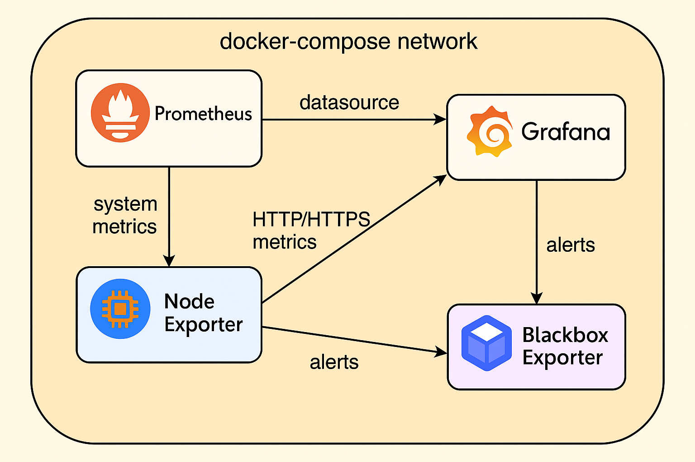
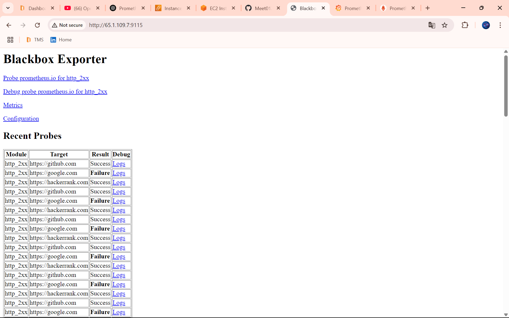
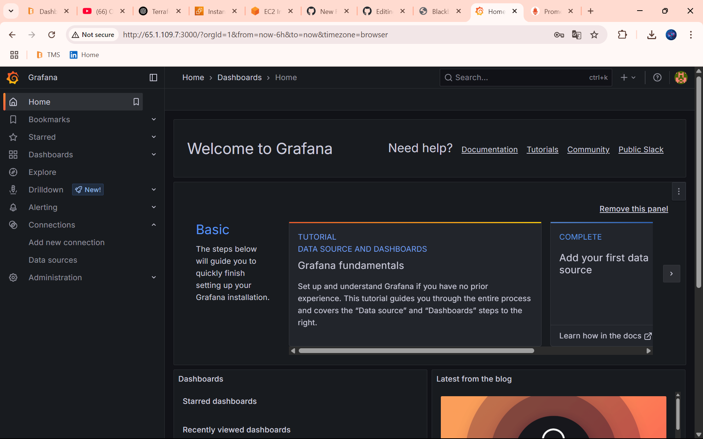
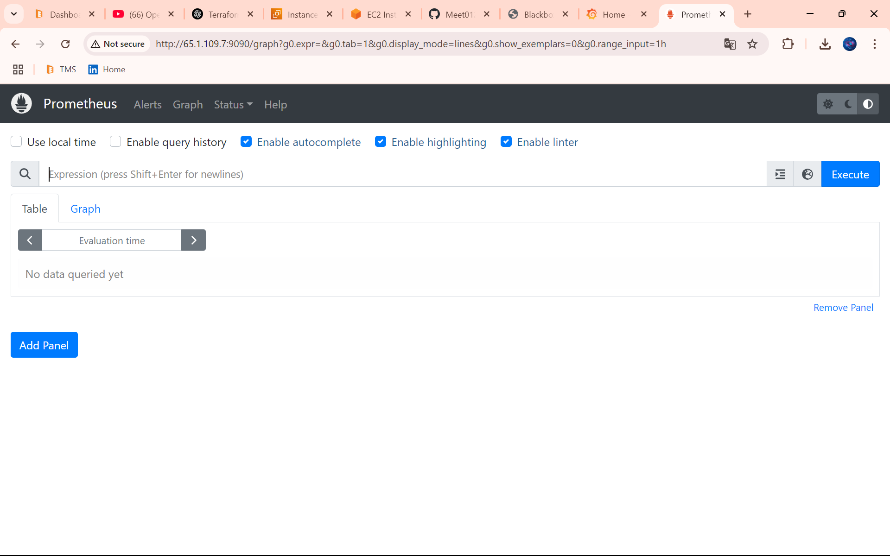
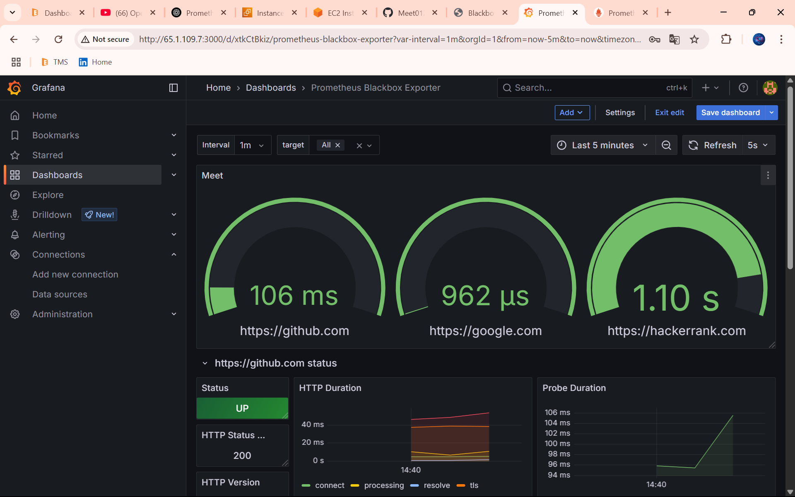
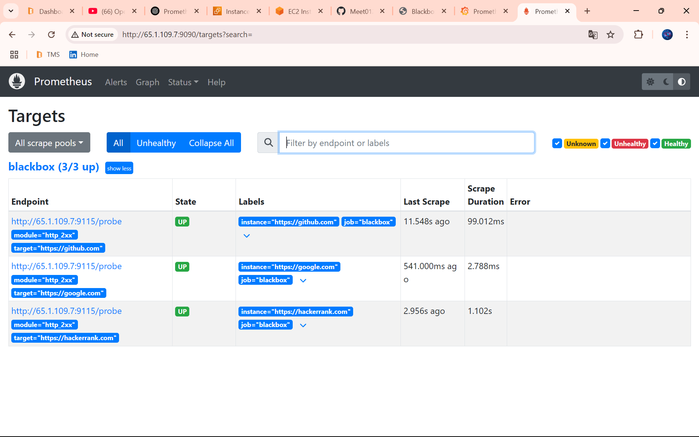

# 🚀 Monitoring Stack with Prometheus, Grafana, and Blackbox Exporter using Docker



This project sets up a complete monitoring stack using Docker: Prometheus for metrics, Grafana for visualization, and Blackbox Exporter for endpoint probing.

---

## 📦 Final Project Structure

```
blackbox_monitoring_project/
├── blackbox_exporter-0.18.0.linux-amd64/
├── clean.sh
├── dashboard.json
├── docker-compose.yml
├── grafana.ini
├── prometheus.yml
├── LICENSE
└── README.md
```

---

---

## ✅ Step 1: Update & Install Required Packages
```bash
apt update -y
sudo apt install net-tools -y           # For netstat
apt install docker.io -y                # Install Docker
apt install docker-compose -y           # Install Docker Compose
```

## ✅ Step 2: Clone the Monitoring Project from GitHub
```bash
git clone <YOUR_REPO>
cd <YOUR_REPO>
```

## ✅ Step 3: (Optional) Run Blackbox Exporter Manually (not needed if using Docker)
```bash
chmod +x -R blackbox_exporter-0.18.0.linux-amd64/
cd blackbox_exporter-0.18.0.linux-amd64/
./blackbox_exporter --config.file=blackbox.yml &> output.log &
```

## ✅ Step 4: Check Port Usage (optional debugging)
```bash
sudo netstat -tunlp
```

## ✅ Step 5: Edit Prometheus Configuration
```bash
cd /home/ubuntu/<Your Repo>/
nano prometheus.yml
# 🔧 Update with your EC2 instance IP
```

## ✅ Step 6: Launch Monitoring Stack via Docker Compose
```bash
docker-compose up -d
```
🔄 This will bring up Prometheus, Grafana, and Blackbox Exporter as Docker containers.

---
## ✅ Step 7: Access the Tools

| Service     | URL                        |
|-------------|----------------------------|
| Blackbox    | http://<Your_EC2_IP>:9115  |



---

---

| Grafana     | http://<Your_EC2_IP>:3000  |

🛡 **Grafana Login:** `admin / admin`

🛡 **Grafana Login Update Password:** `<Your Password> / <Your Password>`



# 📊 Add Prometheus as a Data Source in Grafana
 
Follow these steps to add Prometheus as a data source in Grafana:
 
---
 
## 1. Open Data Sources
 
- Go to the left sidebar menu in Grafana.
- Click on **⚙️ Connections** > **Data Sources**.
 
---
 
## 2. Add Data Source
 
- Search **Prometheus**.
- Click **Prometheus** from the list.
 
---
 
## 3. Configure Prometheus Settings
 
- **Name:** `Prometheus`
- **URL:**  
  ```
  http://<Your_EC2_IP>:9090/
  ```
- Scroll Down
- **other:** HTTP Method
  `Select GET`
 
---
 
## 4. Save & Test
 
- Click **Save & Test** to verify the connection.

# 📊 Import Dashboard

Follow these steps Import Dashboard

- On the left side menu, **click Dashboards → New → Import**
- Paste the GitHub URL to the **.json** file
- OR download the file and click "**Upload .json** file"
- Click **Load**

---

---

| Prometheus  | http://<Your_EC2_IP>:9090  |



---

---
# Final Output





---
